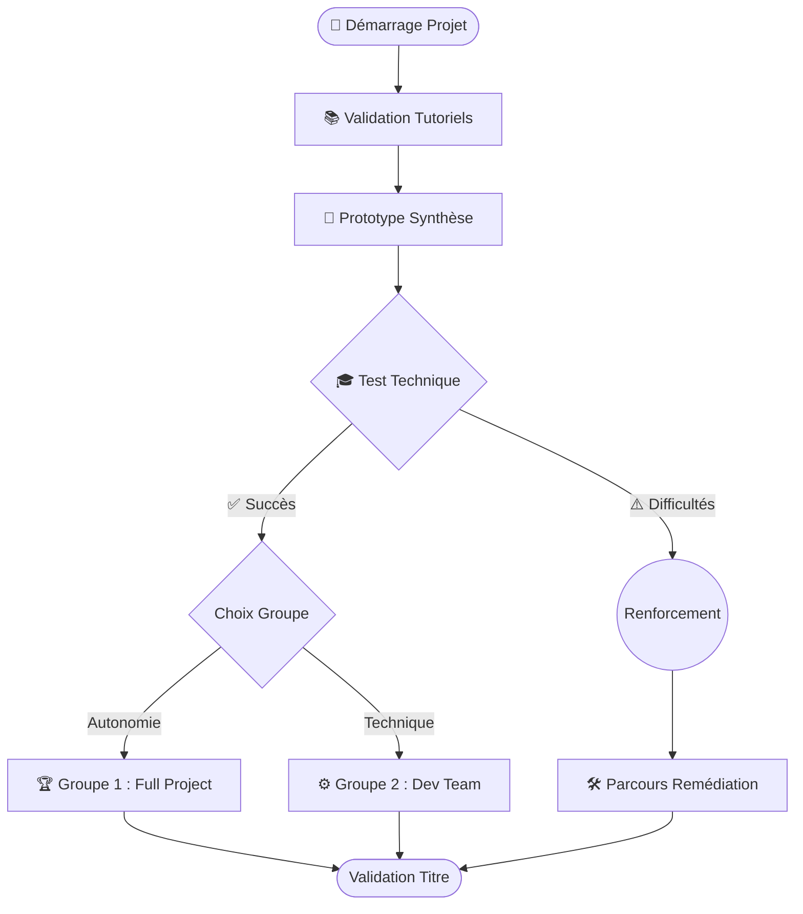
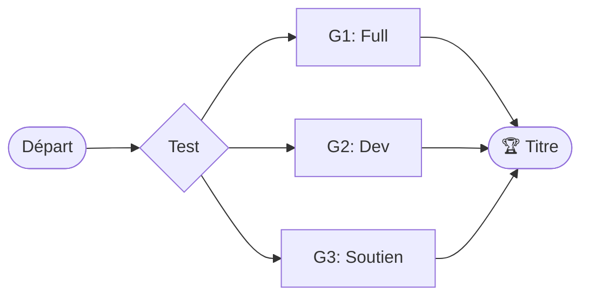

# 🗺️ Stratégie de Groupes & Parcours de Réalisation

Afin d'adapter la pédagogie au rythme de chaque apprenant, la promotion est divisée en 3 groupes de travail pour le Projet Fil Rouge.

---

## 🔁 Vue d'Ensemble

---

## 1. 🎟️ Le Ticket d'Entrée

Avant d'intégrer un groupe de production, chaque apprenant doit valider son socle technique :

1.  **Tutoriels :** 100% des TPs rendus et fonctionnels.
2.  **Prototype :** Capacité à assembler les briques MVC de base.
3.  **Test Technique (Le "Permis de Coder") :**
    *   QCM théorique.
    *   **Live Coding** : Résolution d'un problème type en temps limité.

---

## 2. 👥 Les 3 Groupes

### 🏆 Groupe 1 : "Full Project" (Autonomie)
*   **Pour qui ?** Les avancés qui veulent tout maîtriser.
*   **Mission :** Tout faire de A à Z (Analyse, Design, Code, Deploy).
*   **Livrable :** Un produit unique, customisé.

### 🚀 Groupe 2 : "Dev Team" (Focus Technique)
*   **Pour qui ?** Ceux qui veulent coder sans perdre de temps sur les maquettes.
*   **Mission :** Implémenter le cahier des charges officiel.
*   **Ressources :** Maquettes et Conception fournies.

### 🛠️ Groupe 3 : "Renforcement" (Remédiation)
*   **Pour qui ?** Ceux qui ont besoin de consolider les bases.
*   **Mission :** Parcours guidé "Pas à pas".
*   **Stratégie :** Répétition, Live Coding accompagné, Projet simplifié ("Soli-Light").

---
---

# 📺 ESPACE PRÉSENTATION (SLIDES)

*(Utilisez le mode "Aperçu de la présentation" ou exportez en PDF pour projeter)*

---

# 🚀 Projet Fil Rouge : Organisation
## Stratégie de Réussite & Groupes

---

## 🎯 Notre Objectif Commun

> **Valider le Titre Professionnel**

Mais nous n'avons pas tous le même rythme.
👉 **Solution : 3 Voies pour 1 Destination.**

---

## 🗺️ Le Parcours en un clin d'œil

---

## 🎟️ Étape 1 : Le Ticket d'Entrée

Pour lancer le projet, il faut prouver sa capacité à suivre.

*   ✅ **Tutoriels à jour** (Dette technique = 0)
*   ✅ **Prototype maîtrisé**
*   ✅ **Test Technique validé**

---

## 🏆 Groupe 1 : "Full Project"

**"Je veux être Architecte de ma solution"**

*   **Profil :** Autonome, Avancé.
*   **Départ :** Page Blanche.
*   **Challenge :** Gérer tout le cycle (Besoin utilisateur -> Mise en prod).

---

## ⚙️ Groupe 2 : "Dev Team"

**"Je veux être un Développeur efficace"**

*   **Profil :** Pragmatique, focus Technique.
*   **Départ :** Git Repository (Conception fournie).
*   **Challenge :** Produire un code propre, testé et aux standards pro.

---

## 🛠️ Groupe 3 : "Renforcement"

**"Je veux consolider mes bases"**

*   **Profil :** Besoin d'accompagnement.
*   **Stratégie :** "Learning by Repeating".
*   **Programme :**
    1.  Reprise des bases (MVC, Routing).
    2.  Live Coding tutoré.
    3.  Projet adapté ("Soli-Light").

---

## 📅 Prochaines Étapes

1.  **Aujourd'hui :** Finalisation des Tutos.
2.  **Lundi :** Test Technique (QCM + Code).
3.  **Mardi :** Lancement des Groupes !

**À vous de jouer ! 🚀**