# 🗺️ Stratégie de Groupes & Parcours de Réalisation

Afin d'adapter la pédagogie au rythme de chaque apprenant, la promotion est divisée en 3 groupes de travail pour le Projet Fil Rouge.

> 📺 **Présentation :** Un support de cours au format diorama est disponible dans le fichier [`02_parcours_pedagogique_slides.md`](./02_parcours_pedagogique_slides.md).

---

## 🔁 Vue d'Ensemble

```mermaid
flowchart TD
    Start([🚀 Démarrage Projet]) --> Tutos[📚 Validation Tutoriels]
    Tutos --> Proto[🧩 Prototype Synthèse]
    Proto --> Test{🎓 Test Technique}
    
    Test -- "✅ Succès" --> Choix{Choix Groupe}
    Test -- "⚠️ Difficultés" --> G3_Route((Renforcement))
    
    Choix -- "Autonomie" --> G1[🏆 Groupe 1 : Full Project]
    Choix -- "Technique" --> G2[⚙️ Groupe 2 : Dev Team]
    
    G1 --> Fin([Validation Titre])
    G2 --> Fin
    G3_Route --> G3_Step[🛠️ Parcours Remédiation] --> Fin
```

---

## 1. 🎟️ Le Ticket d'Entrée

Avant d'intégrer un groupe de production, chaque apprenant doit valider son socle technique :

1.  **Tutoriels :** 100% des TPs rendus et fonctionnels.
2.  **Prototype :** Capacité à assembler les briques MVC de base.
3.  **Test Technique (Le "Permis de Coder") :**
    *   QCM théorique.
    *   **Live Coding** : Résolution d'un problème type en temps limité.

---

## 2. 👥 Les 3 Groupes

### 🏆 Groupe 1 : "Full Project" (Autonomie)
*   **Pour qui ?** Les avancés qui veulent tout maîtriser.
*   **Mission :** Tout faire de A à Z (Analyse, Design, Code, Deploy).
*   **Livrable :** Un produit unique, customisé.

### 🚀 Groupe 2 : "Dev Team" (Focus Technique)
*   **Pour qui ?** Ceux qui veulent coder sans perdre de temps sur les maquettes.
*   **Mission :** Implémenter le cahier des charges officiel.
*   **Ressources :** Maquettes et Conception fournies.

### 🛠️ Groupe 3 : "Renforcement" (Remédiation)
*   **Pour qui ?** Ceux qui ont besoin de consolider les bases.
*   **Mission :** Parcours guidé "Pas à pas".
*   **Stratégie :** Répétition, Live Coding accompagné, Projet simplifié ("Soli-Light").