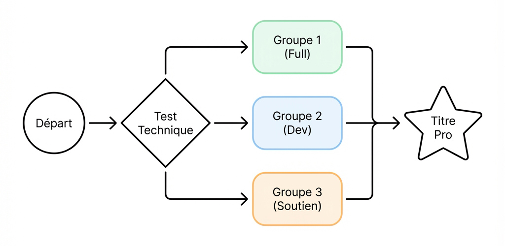

# 🚀 Projet Fil Rouge : Organisation
## Stratégie de Réussite & Groupes

---

## 🎯 Notre Objectif Commun

> **Valider le Titre Professionnel**

Mais nous n'avons pas tous le même rythme.
👉 **Solution : 3 Voies pour 1 Destination.**

---

# 🗺️ Le Parcours en un clin d'œil

  

---

## 🎟️ Étape 1 : Le Ticket d'Entrée

Pour lancer le projet, il faut prouver sa capacité à suivre.

*   ✅ **Tutoriels à jour** (Dette technique = 0)
*   ✅ **Prototype maîtrisé**
*   ✅ **Test Technique validé**

---

## 🏆 Groupe 1 : "Full Project"

**"Je veux être Architecte de ma solution"**

*   **Profil :** Autonome, Avancé.
*   **Départ :** Page Blanche.
*   **Challenge :** Gérer tout le cycle (Besoin utilisateur -> Mise en prod).

---

## ⚙️ Groupe 2 : "Dev Team"

**"Je veux être un Développeur efficace"**

*   **Profil :** Pragmatique, focus Technique.
*   **Départ :** Git Repository (Conception fournie).
*   **Challenge :** Produire un code propre, testé et aux standards pro.

---

## 🛠️ Groupe 3 : "Renforcement"

**"Je veux consolider mes bases"**

*   **Profil :** Besoin d'accompagnement.
*   **Stratégie :** "Learning by Repeating".
*   **Programme :**
    1.  Reprise des bases (MVC, Routing).
    2.  Live Coding tutoré.
    3.  Projet adapté ("Soli-Light").

---

## 📅 Prochaines Étapes

1.  **Aujourd'hui :** Finalisation des Tutos.
2.  **Lundi :** Test Technique (QCM + Code).
3.  **Mardi :** Lancement des Groupes !

**À vous de jouer ! 🚀**
