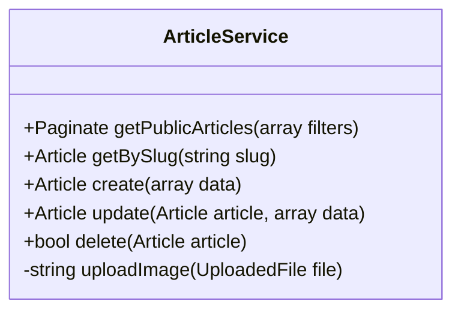

# 🟢 Sprint 1 : Visiteur & Découverte

## 📋 Pré-requis Pédagogiques
Pour réussir ce Sprint, vous devez avoir validé les sessions de formation suivantes :

### 🎓 Sessions de Formation
*   ✅ **Session S3 :** Lancement Laravel & Interface Publique (Routing, Controller, Blade).
*   ✅ **Session S4 :** Base de Données & Modèles (Migration, Eloquent).

### 🔬 Labs & Veille
*   🧪 **Lab Vite :** Savoir configurer et compiler Tailwind CSS pour le frontend.
*   🧪 **Lab AJAX :** Comprendre les requêtes asynchrones (pour la recherche instantanée).
*   📚 **Veille UX/UI :** "One Page Design" & Structure d'Information.
*   🎨 **Veille UI Kit :** Découverte de **Preline UI** (basé sur Tailwind) vs ses concurrents (Flowbite, DaisyUI).

## 1. � Besoin
**Objectif :** Permettre aux visiteurs de découvrir et lire le contenu du blog (Socle MVP).
*   Offrir une interface de lecture fluide et moderne.
*   Permettre une recherche rapide d'articles.

## 2. 🔍 Analyse
*   **Cas d'Utilisation (Use Cases) :**
    *   `UC_List` : Affichage grille des articles.
    *   `UC_Read` : Page détail article.
    *   `UC_Search` : Recherche dynamique (AJAX).
    *   `UC_Filter` : Filtrage par Catégorie/Tag.
*   **Diagramme :** [sprint-01-visiteur.puml](sprint-01-visiteur.puml)

## 3. 🏗️ Conception
*   **Base de Données / Modèles :**
    *   > [Voir Diagramme de Classes](../../../03_conception/diagramme-classes.mmd)
    *   **Entités :** `Article`, `Category`, `Tag`, `User` (Auteur), `Comment`, `Role`.
    *   **Relations clés :** Article-Category (n-1), Article-Tag (n-n), Article-User (n-1).
*   **Maquettage UI :**
    *   > [Voir Maquettes Publiques](../../../03_conception/maquettes-public/index.html)
    *   **Pages clés :** Accueil (`index`), Détail Article (`article`), Recherche (`search`).

## 4. 💻 Réalisation (Tâches Techniques)
*   **Setup :**
    *   [ ] Init Laravel 12 + Git Flow (branche `sprint-1`).
    *   [ ] Config Preline UI + Tailwind (Vite). **⛔ Pas de CDN !** Tout doit passer par `npm` et Vite.
*   **Backend :**
    *   [ ] Migrations & Seeders (Factory pour 20 articles).
    *   [ ] `PublicController` (index, show).
    *   [ ] **Service Layer :**
        *   `ArticleService` (Logic filtre/recherche).
        *   `CategoryService` & `TagService` (Pour lister les filtres - *Architecture stricte*).
 
*   **Frontend :**
    *   [ ] **Layouts :**
        *   `layouts/public.blade.php` (Header/Footer Visiteur).
        *   `layouts/admin.blade.php` (Structure vide pour l'instant, pour préparer le Back-Office).
    *   [ ] Vue `home.blade.php` (Grille responsive).
    *   [ ] Vue `article.show.blade.php` (Détail + Sidebar).
*   

## Indice de solution
(Pour vous aider à structurer vos classes)

